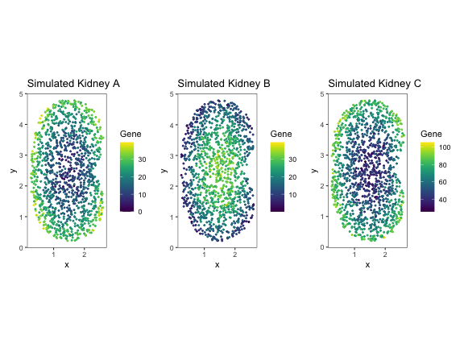
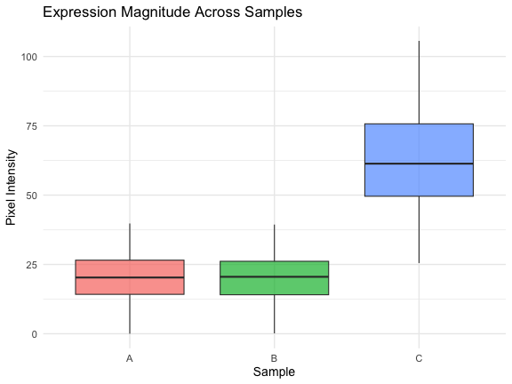
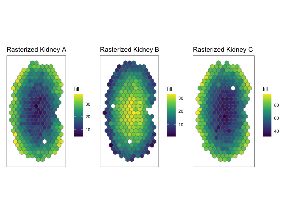
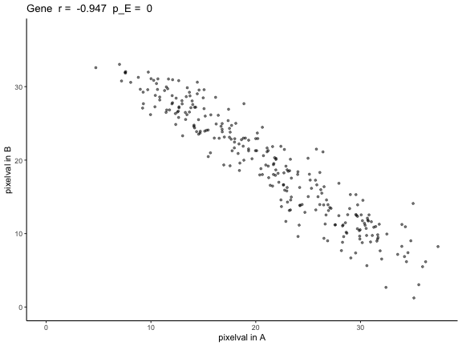
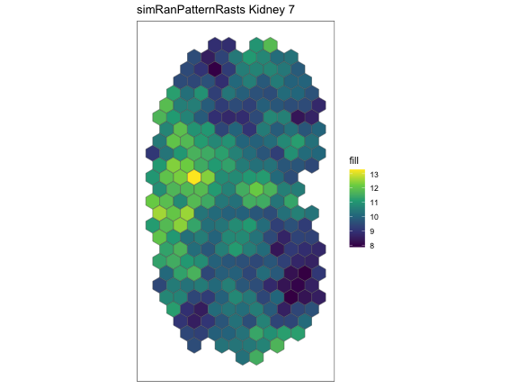
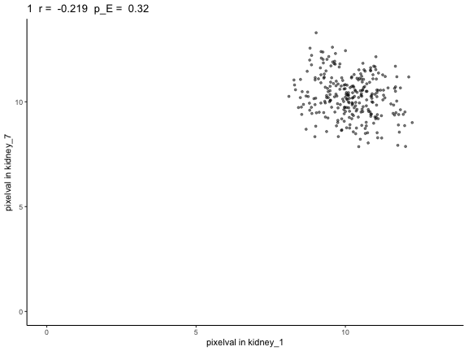
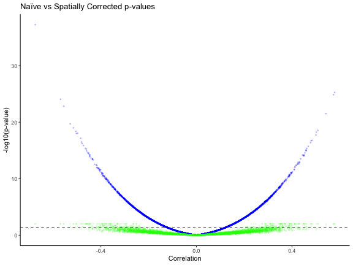
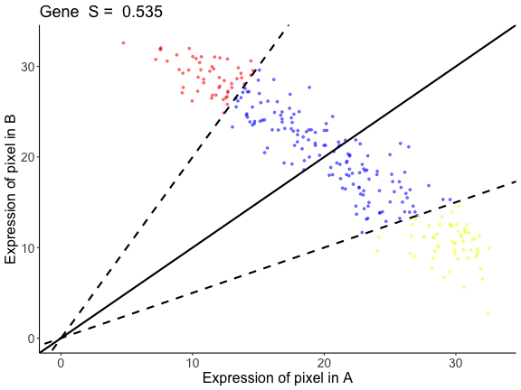
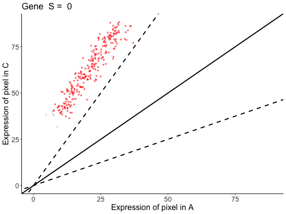

# Introducton

Spatial transcriptomic (ST) technologies enable the investigation of how
tissue organization relates to cellular function by profiling the
spatial location of cells within a tissue and the gene expression
profiles associated with those locations. As ST technologies are
increasingly applied in the context of disease characterization and
translational research, identifying genes that spatially change in their
expression patterns in diseased tissues as compared to healthy controls
could reveal localized molecular variation associated with pathological
processes, offering insights into disease mechanisms as well as aiding
in the discovery of diagnostic biomarkers.

Attempts at such comparative analysis of ST datasets can be performed
using traditional non-spatial bulk or single cell transcriptomics
analysis approaches such as differential gene expression (DGE) analysis,
comparing the mean expression of genes between two datasets by
fold-change. However, this type of DGE analysis does not consider the
spatial information. As such, a gene can be identified as not
differentially expressed across two datasets by having the same mean
gene expression, but the gene can still have two distinct spatial
patterns of expression. On the other hand, a gene can be identified as
differentially expressed across the two datasets by having very
different mean gene expression but have spatial expression patterns that
are highly similar. By not considering spatial information, traditional
DGE analysis fails to characterize such cases. To demonstrate these
cases, we simulated ST datasets where one pair of genes has different
radial expression patterns but the same mean expression, while the other
pair has same radial expression patterns but different mean expression.

Clifton K, Jiang V, Singh S, Matsuura R, Rabb H, Fan J., STcompare:
Comparative spatial transcriptomics data analysis to characterize
differentially spatially patterned genes. bioRxiv 2025.11.21.689847.
doi: <https://doi.org/10.1101/2025.11.21.689847>

# Installation

    require(remotes)
    remotes::install_github('JEFworks-Lab/STcompare')

# Tutorial

In this tutorial we will walk through applying `STcompare`’s two
differential spatial comparison tests to simulated kidney datasets:

1.  **Spatial Correlation:** Person correlation assumes that each sample
    is independent and identically distributed random variables.
    However, in terms of gene expression, the gene expression of one
    cell influences the gene expression of the neighboring cells.
    Spatial Correlation computes the empirical p-value instead to
    consider the dependent relationship. We will show why the p-value
    null distribution correction is needed in the Spatial Correlation
    test.

2.  **Spatial Fold Change:** Computes a Similarity score for each gene
    in the comparison, compares the change in expression at matched
    locations.

## Load Libraries

    library(STcompare)
    library(SpatialExperiment)
    library(SEraster)
    library(ggplot2)
    library(patchwork)
    library(viridis)

## Simulated Pattern Kidney

Here we load the simulated kidney data `speKidney` that we will use to
demonstrate `spatialCorrelation` and `spatialSimilarity`

`speKidney` is a list of three `SpatialExperiment` objects representing
three simulated single-cell kidney datasets named A, B, and C. A
[`SpatialExperiment`](%22https://www.bioconductor.org/packages/release/bioc/html/SpatialExperiment.html%22)
object store spatial transcriptomics data, combining gene expression
matrices with the spatial coordinates of each spatial location. Each
element of `speKidney` contains `assays`: gene-by-cell expression
matrices and `spatialCoords`: x–y spatial coordinates for each spatial
location.

    data("speKidney") 
    head(speKidney)
    #> $A
    #> class: SpatialExperiment 
    #> dim: 1 1229 
    #> metadata(0):
    #> assays(1): counts
    #> rownames(1): Gene
    #> rowData names(0):
    #> colnames(1229): cell1 cell2 ... cell1228 cell1229
    #> colData names(1): sample_id
    #> reducedDimNames(0):
    #> mainExpName: NULL
    #> altExpNames(0):
    #> spatialCoords names(2) : x y
    #> imgData names(0):
    #> 
    #> $C
    #> class: SpatialExperiment 
    #> dim: 1 1297 
    #> metadata(0):
    #> assays(1): counts
    #> rownames(1): Gene
    #> rowData names(0):
    #> colnames(1297): cell1 cell2 ... cell1296 cell1297
    #> colData names(1): sample_id
    #> reducedDimNames(0):
    #> mainExpName: NULL
    #> altExpNames(0):
    #> spatialCoords names(2) : x y
    #> imgData names(0):
    #> 
    #> $B
    #> class: SpatialExperiment 
    #> dim: 1 1242 
    #> metadata(0):
    #> assays(1): counts
    #> rownames(1): Gene
    #> rowData names(0):
    #> colnames(1242): cell1 cell2 ... cell1241 cell1242
    #> colData names(1): sample_id
    #> reducedDimNames(0):
    #> mainExpName: NULL
    #> altExpNames(0):
    #> spatialCoords names(2) : x y
    #> imgData names(0):

Looking at the row dimensions and names, we can see that each dataset
contains one gene called `Gene`. Looking at the column dimensions and
names, we can see that the three samples vary slightly in the number of
spatial locations, i.e. cells.

Next we plot the spatial patterns of gene expression for each dataset.

    # This function takes the Spatial Experiment Object and creates a plot 
    # of the spatial patterns of gene expression. 
    plotSpatialPatterns <- function(spatialExperimentObj, name) {
      df <- cbind(
        as.data.frame(spatialCoords(spatialExperimentObj)),
        as.data.frame(colData(spatialExperimentObj))
      )
      
      df$Gene <- as.numeric(assay(spatialExperimentObj, "counts")["Gene", ])
      
      ggplot(df, aes(x = x, y = y, color = Gene)) +
        geom_point(size = 0.6) +
        coord_equal() +
        theme_bw() +
        theme(
          panel.grid.major = element_blank(),
          panel.grid.minor = element_blank()
        ) + 
        scale_color_viridis(option = "D") +
        labs(
          x = "x",
          y = "y",
          color = "Gene",
          title = paste("Simulated Kidney", name)
        )
    }

    pA <- plotSpatialPatterns(speKidney$A, "A")
    pB <- plotSpatialPatterns(speKidney$B, "B")
    pC <- plotSpatialPatterns(speKidney$C, "C")

    pA + pB + pC

Upon plotting the gene expression spatial patterns for each dataset, we
can see that A and B share gene expression magnitude but differ in
spatial pattern, and A and C share spatial pattern but differ in gene
expression magnitude.

### Mean comparision is not sufficient

Traditionally, these simulated kidneys would be compared using
differential gene expression (DGE) analysis such as comparing the
average of the mean expression.

    # Convert the counts for each kidney (A, B, C) into one dataframe.
    # Each kidney’s expression counts are extracted from the "counts" assay and stored as a numeric vector.
    df <- data.frame(
      value = c(
        as.numeric(assay(speKidney$A, "counts")), 
        as.numeric(assay(speKidney$B, "counts")), 
        as.numeric(assay(speKidney$C, "counts"))
      ),
      
      # Create a "sample" column showing which kidney each pixel belongs to.
      # The `rep()` call ensures that the correct number of labels (A/B/C) is assigned
      # based on the length of each counts vector.
      sample = factor(rep(
        c("A", "B", "C"),
        times = c(
          length(as.numeric(assay(speKidney$A, "counts"))), 
          length(as.numeric(assay(speKidney$B, "counts"))), 
          length(as.numeric(assay(speKidney$C, "counts")))
        )
      ))
    )

    # Plot a boxplot comparing the distribution of pixel intensities across the 3 kidneys.
    # This represents a traditional magnitude-only comparison, 
    # which cannot distinguish pattern similarity/differences.
    compare_box_plot <- ggplot(df, aes(x = sample, y = value, fill = sample)) +
      geom_boxplot(outlier.shape = 16, outlier.size = 1.5, alpha = 0.7) +
      labs(x = "Sample", y = "Pixel Intensity", title = "Expression Magnitude Across Samples") +
      theme_minimal(base_size = 14) +
      theme(legend.position = "none")
    compare_box_plot

Comparing the mean between A and B does not capture the spatial gene
expression difference. Comparing the means between A and C tells us the
expression magnitudes have a fold difference, but it does not capture
how the gene expression patterns in A and C are similarly spatially
organized.

1.  We will use `spatialCorrelationGeneExp` test to quantify the
    correlation in gene expression pattern between (A and B) and (A and
    C). Where we expect (A and B) will have a significant negative
    correlation and we expect (A and C) will have a significant positive
    correlation.
2.  And we will use `SpatialSimilarity` test to quantify the difference
    in gene expression magnitude at matched spatial locations not
    reflected by DGE between (A and B)

## Using STcompare

### Input formatting

1.  **Tissue Alignment**  
    For `STcompare` to produce meaningful comparisons, the tissues must
    first be spatially aligned so that corresponding structures are
    matched across samples. The `STalign` package can be used to align
    two tissues. [STalign
    Tutorial](%22https://jef.works/STalign/notebooks/merfish-merfish-alignment.html%22)

2.  **Rasterization**  
    `STcompare` takes a list of
    [`SpatialExperiment`](%22https://bioconductor.org/packages/release/bioc/html/SpatialExperiment.html%22)
    objects and requires them to have matched spatial locations. Use
    `SEraster` to rasterize multiple samples onto the same coordinate
    system, allowing `STcompare` to pairwise compare across any number
    of samples. [SEraster formatting
    tutorial](%22https://jef.works/SEraster/articles/formatting-SpatialExperiment-for-SEraster.html%22)

Since our simulated data is already aligned we first use `SEraster` to
rasterize this list of simulated kidneys, stored as `SpatialExperiment`
objects, onto the same coordinate plane.

    rastKidney <- SEraster::rasterizeGeneExpression(speKidney,
                    assay_name = 'counts', resolution = 0.2,
                    square = FALSE)

    # After rasterization, the output is a SpatialExperiment object, but the spatial units are now raster pixels rather than individual cells or spots. The assay has been converted to pixelval, and additional metadata (num_cell, cellID_list, geometry) records which original cells contributed to each pixel.
    head(rastKidney)
    #> $A
    #> class: SpatialExperiment 
    #> dim: 1 282 
    #> metadata(0):
    #> assays(1): pixelval
    #> rownames(1): Gene
    #> rowData names(0):
    #> colnames(282): pixel52 pixel53 ... pixel416 pixel417
    #> colData names(6): num_cell cellID_list ... geometry sample_id
    #> reducedDimNames(0):
    #> mainExpName: NULL
    #> altExpNames(0):
    #> spatialCoords names(2) : x y
    #> imgData names(0):
    #> 
    #> $C
    #> class: SpatialExperiment 
    #> dim: 1 287 
    #> metadata(0):
    #> assays(1): pixelval
    #> rownames(1): Gene
    #> rowData names(0):
    #> colnames(287): pixel51 pixel52 ... pixel417 pixel431
    #> colData names(6): num_cell cellID_list ... geometry sample_id
    #> reducedDimNames(0):
    #> mainExpName: NULL
    #> altExpNames(0):
    #> spatialCoords names(2) : x y
    #> imgData names(0):
    #> 
    #> $B
    #> class: SpatialExperiment 
    #> dim: 1 279 
    #> metadata(0):
    #> assays(1): pixelval
    #> rownames(1): Gene
    #> rowData names(0):
    #> colnames(279): pixel53 pixel65 ... pixel416 pixel417
    #> colData names(6): num_cell cellID_list ... geometry sample_id
    #> reducedDimNames(0):
    #> mainExpName: NULL
    #> altExpNames(0):
    #> spatialCoords names(2) : x y
    #> imgData names(0):

    # These are the plots to visualize what the kidneys looks like 
    pA <- plotRaster(rastKidney$A, plotTitle = "Rasterized Kidney A")
    pB <- plotRaster(rastKidney$B, plotTitle = "Rasterized Kidney B")
    pC <- plotRaster(rastKidney$C, plotTitle = "Rasterized Kidney C")

    pA + pB + pC

### Spatial correlation

Now, we will use `spatialCorrelationGeneExp` to understand correlation
of expression across pixels.

As input `spatialCorrelationGeneExp` takes a list of two
`SpatialExperiment` objects. First, we will compare A and B.

    # From the list of rasterized kidneys, rastKidney, we will take a subset of rastKidney 
    # rastGexpListAB is a list of two kidneys, A and B 
    rastGexpListAB <- list(A = rastKidney$A, B = rastKidney$B)

    # spatialCorrelationGeneExp takes input of a list of two SpatialExperiment objects -- rastGexpListAB
    # nThreads, the default is 1, should be set to the number of cores available to allow for parallel computing 
    scAB <- spatialCorrelationGeneExp(rastGexpListAB, nThreads = 1)

    # correlationCoef is showing a negative linear relationship 
    # Both the naive and the permuted p-values (pValuePermuteY and pValuePermuteX) are showing that the correlation is significant 
    head(scAB)
    #>      correlationCoef   pValueNaive pValuePermuteX pValuePermuteY deltaStarMedianX deltaStarMedianY   deltaStarX   deltaStarY nullCorrelationsX nullCorrelationsY
    #> Gene      -0.9472813 5.652003e-136              0              0              0.3              0.2 0.3, 0.3.... 0.2, 0.2....      -0.01401....      -0.08742....

As output `spatialCorrelationGeneExp` returns:

-   `correlationCoef` Pearson’s correlation coefficient shows the
    strength and direction of a linear relationship between the two
    objects
-   `pValueNaive` is the analytical p-value naively assuming independent
    observations, often time not accurate
-   `pValuePermuteX` is the p-value when creating an empirical null from
    permutations of observations in X
-   `pValuePermuteY` is the p-value when creating an empirical null from
    permutations of observations in Y – we recommend using the higher of
    `pValuePermuteY` or `pValuePermuteX`, as a more accurate p-value
    than `pValueNaive`
-   `deltaStarMedianX` the median delta star (the delta which minimizes
    the difference between the variogram of the permutation and the
    variogram of observations) across permutations of X
-   `deltaStarMedianY` the median delta star across permutations of Y
-   `deltaStarX` is list of delta star for all permutations of X
-   `deltaStarY` is list of delta star for all permutations of Y
-   `nullCorrelationsX` is a list of correlation coefficients for Y and
    all permutations of X
-   `nullCorrelationsY` is a list of correlation coefficients for X and
    all permutations of Y

Because `correlationCoef = -0.9472813` and `pValuePermuteX` and
`pValuePermuteY` &lt; 0.05, we can conclude that gene expression at
matched pixel locations is negatively correlated in A and B as expected.

We can also visualize our results with `plotCorrelationGeneExp`. In the
title we include the empirical p-value `p_E` as the higher of
`pValuePermuteY` or `pValuePermuteX`.

    # visualization of the negative correlation 
    # plotCorrelationGeneExp needs the list of rasterized SpatialExperiment objects, the table from spatialCorrelationGeneExp of the same objects, 
    # and the gene name you are trying to plot. In the case, the gene name is "Gene". 
    expAB <- plotCorrelationGeneExp(rastGexpListAB, scAB, "Gene")
    expAB

We can repeat the analysis for A and C.

    # From the list of rasterized kidneys, rastKidney, we will take a subset of rastKidney 
    # rastGexpListAC is a list of two kidneys, A and C
    rastGexpListAC <- list(A = rastKidney$A, C = rastKidney$C)

    # correlationCoef is showing a positive linear relationship 
    # Both the naive and the permuted p-values (pValuePermuteY and pValuePermuteX) are showing that the correlation is significant 
    scAC <- spatialCorrelationGeneExp(rastGexpListAC)
    head(scAC)
    #>      correlationCoef   pValueNaive pValuePermuteX pValuePermuteY deltaStarMedianX deltaStarMedianY   deltaStarX   deltaStarY nullCorrelationsX nullCorrelationsY
    #> Gene       0.9431531 1.409195e-133              0              0              0.2              0.2 0.2, 0.2.... 0.2, 0.4....      0.188003....      0.174202....

    # visualization of the positive correlation
    # plotCorrelationGeneExp needs the list of rasterized SpatialExperiment objects, the table from spatialCorrelationGeneExp of the same objects, 
    # and the gene name you are trying to plot. In the case, the gene name is "Gene".
    expAC <- plotCorrelationGeneExp(rastGexpListAC, scAC, "Gene")
    expAC

Because `correlationCoef = 0.9431531` and `pValuePermuteX` and
`pValuePermuteY` &lt; 0.05, we can conclude that gene expression at
matched pixel locations is positively correlated in A and C.

### Why we generate empirical p-values through permutations

Next, we will demonstrate how using the analytical p-value, which
naively assumes spatial locations are independent observations, when
interpreting Pearson’s correlation coefficients results in a high false
positive rate when the datasets that are compared have spatial
autocorrelation.

`simRanPatternRasts` is a list of 100 simulated `SpatialExperiment`
objects representing kidney-shaped datasets, each containing one
independently generated spatially patterned (i.e spatially
autocorrelated) gene with no correlation between datasets. Each dataset
consists of N = 5000 simulated cells distributed within a kidney-shaped
region, with spatial coordinates and expression values generated from
Gaussian random fields. All of the objects in `simRanPatternRasts` are
already rasterized onto the same coordinate plane.

Using the kidney 1 and kidney 7 in the `simRanPatternRasts` dataset, we
plot the spatial gene expression patterns and run
`spatialCorrelationGeneExp` expecting the two datasets to have no
significant correlation.

    # using plotRaster from the SEraster package to visualize kidney 1 and 7
    plotRaster(simRanPatternRasts[[1]], plotTitle = "simRanPatternRasts Kidney 1")

    plotRaster(simRanPatternRasts[[7]], plotTitle = "simRanPatternRasts Kidney 7")

    # taking a subset of simRanPatternRasts
    # rastGexpList is a list of rasterize SpatialExperiment objects kidney 1 and kidney 7 
    rastGexpList <- list(kidney_1 = simRanPatternRasts[[1]], kidney_7 = simRanPatternRasts[[7]])

    # finding the correlation and the p-value of kidney 1 and kidney 7 
    sc <- spatialCorrelationGeneExp(rastGexpList)

    # the naive p-value is showing that the correlation is significant 
    # while both of the permuted p-values are showing not significant p-values 
    head(sc) 
    #>   correlationCoef  pValueNaive pValuePermuteX pValuePermuteY deltaStarMedianX deltaStarMedianY   deltaStarX   deltaStarY nullCorrelationsX nullCorrelationsY
    #> 1      -0.2189486 0.0002533931           0.26           0.24              0.1              0.3 0.1, 0.1.... 0.1, 0.9....      -0.15756....      0.109176....

    # the plot further shows that there isn't a correlation between kidney 1 and kidney 7
    plotCorrelationGeneExp(rastGexpList, sc, "1")

We see that the naive p-value is in the significant range (p-value &lt;
0.05). However, based on the way the kidneys are simulated (simulated to
have no correlation), this should not be the case, which is reflected in
the permuted p-values. Unlike the naive p-value, the permuted p-values
do not show significant correlation.

Additionally, for each pairwise kidney SpatialExperiment object in the
list of 100 random simulations, the corrected p-value can be computed
using `spatialCorrelationGeneExp` for each pair. To reduce runtime for
the tutorial, we provide the output from running this function as
`simRanPatternResults.RData`.

    # Full script to generate the precomputed vignette results available at:
    # system.file("scripts", "simRanPatternSpatialCorrelation.R", package = "STcompare")

    # load data 
    data_path <- system.file("extdata", "simRanPatternResults.RData", package = "STcompare")
    load(data_path)

    # Var1 and Var2 is every pairwise combination between the 100 kidneys 
    # cors is the correlation coefficient of that pair 
    # corspv is the naive p-value for that pair 
    # corspv_correct is the permuted p-value for that pair (chosen to be the higher of pValuePermuteY and pValuePermuteX)
    head(cors_df)
    #>   Var1 Var2        cors     corspv corspv_corrected
    #> 1    1    1  1.00000000 0.00000000               NA
    #> 2    2    1 -0.04158115 0.49227077             0.85
    #> 3    3    1  0.09066560 0.13439158             0.56
    #> 4    4    1  0.05189013 0.39310096             0.80
    #> 5    5    1  0.11116927 0.06515094             0.45
    #> 6    6    1  0.10915193 0.07229390             0.47

    # remove the na values 
    cors_df <- na.omit(cors_df)

    naive_vs_correct_p_value <- ggplot(cors_df) +
      geom_point(aes(x =cors, y = -log10(corspv)), alpha = 0.1, size = 0.5, color = "blue") +
      geom_point(aes(x =cors, y = -log10(corspv_corrected)), alpha = 0.1, size = 0.5, color = "green") +
      theme_classic() +
      labs(x = "Correlation", y = "-log10(p-value)",
           title = "Naïve vs Spatially Corrected p-values") +
      geom_hline(yintercept = -log10(0.05), linetype = 'dashed', color = "black")  +
      ylim(min(-log10(cors_df$corspv), na.rm = TRUE), max(-log10(cors_df$corspv), na.rm = TRUE)) +
      labs(x = "Correlation" , y = "-log10(p-value)")
    naive_vs_correct_p_value
    #> Warning: Removed 85 rows containing missing values or values outside the scale range (`geom_point()`).

The blue is the naive p-value for a given pair and the green is the
permuted p-value for a given pair. Without p-value correction, we
observe that 50% of these analytical p-values are less than 0.05, while
after correcting for p-value only 4% of the empirical p-values are less
than 0.05.

Therefore, the permuted p-value is needed to more accurately capture
true correlation significance.

### Spatial fold change

Now, we use `spatialSimilarity` to understand the magnitude changes
across matched spatial locations.

Here, we find the spatialSimilarity pairwise between (A and B) and (A
and C) in `rastKidney`.

First, we will compare A and B. Let *x* be the expression of pixel in A
and *y* be the expression of that same pixel in B. Then a pixel is
defined as similar if *|log2(y/x)| &lt; b*. As default we set *b = 1* so
that pixels are similar if there is a less than two-fold change.

Then the similarity score *S* is the proportion of similar pixels over
the total number of pixels.

    # spatialSimilarity also takes in a list of 2 SpatialExperiment objects you want to compare between 
    # t1 and t2 are the thresholding value for the first and second object in the list. 
    # The threshold is used to remove pixels that have no or little expression for a given gene in the pixel.
    # Failure to remove those those pixels will result in a trivial similarity score due to noise. 
    # If t1 and t2 aren't provided, minQuantile is used to threshold based on the quantile of expression. 
    # The default for minQuantile is 0.05, meaning by default the pixels at the bottom 5% are removed. 
    # minPixels is the percentage of pixels left after thresholding. The default is 0.1. 
    # When there is not enough pixels left, the similarity score will also be trivial.
    # foldChange is the number of fold that are considered similar. The default is 1 fold. 

    # compare kidney A and B 
    sAB <- spatialSimilarity(
      list(A = rastKidney$A, B = rastKidney$B)
    )

    # compare kidney A and C 
    sAC <- spatialSimilarity(
      list(A = rastKidney$A, C = rastKidney$C)
    )

To visualize the results of comparing A and C with `spatialSimilarity`
we use the `linearRegression` and `pixelClass` functions.

    # To get the linear regression and the pixel classification plots, 
    # the inputs are the spatialSimilarity output and the gene name 

    # The Linear regression shows the areas in which gene expression 
    # each pixels falls, the pixel is either: higher in B, similar, higher in A  
    lrAB <- linearRegression(input=sAB, gene = "Gene")
    lrAB

    # Similar to the linear regression plot, the pixel classification plot takes 
    # the plot of the rasterized kidney and classifies each pixel with the pixels 
    # that are below the threshold are gray 
    pcAB <- pixelClass(input=sAB, gene="Gene")
    pcAB

For gene `Gene` in the comparison between A and B, we see that A and B
has a similarity score of S=0.535. This means that 53.5% of the
intersecting pixels between A and B are within a two-fold change

We can also visualize the results of comparing A and C.

    # all the pixels have higher expression in C than in A, 
    # and are outside of the similar expression boundaries

    lrAC <- linearRegression(input=sAC, gene = "Gene")
    lrAC

    pcAC <- pixelClass(input=sAC, gene="Gene")
    pcAC

All the pixels have over 2-fold increase in C relative to the same
pixels in A.

# Conclusion

In spatial data, changes in expression pattern and magnitude can be
independent observations.

-   A and B are negatively correlated but have similar magnitude at
    matched spatial locations
-   A and C are positively correlated but do not have similar magnitude
    at matched spatial locations

We demonstrate that `STcompare` can be used to identify these
differences that would otherwise not have been detected using mean gene
expression magnitude comparison. We also demonstrate that `STcompare`
generates empirical p-values, providing p-value correction that is
needed to take into account that gene expression in each pixel is not
independent from that of its neighbors’.
