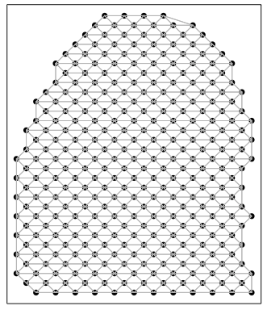

```{r, include = FALSE}
knitr::opts_chunk$set(
  cache = TRUE,
  collapse = TRUE,
  comment = "#>",
  fig.width = 8,
  fig.height = 6,
  dpi = 72,
  dev = "png",
  fig.path = "acute-kidney-injury-10x-visium/"

)
```

```{r setup}
library(STcompare)
library(SpatialExperiment)
library(MERINGUE)
library(rhdf5)
library(ggplot2)
library(dplyr)
library(patchwork)
library(Matrix)
library(BiocGenerics)
```

# Introduction 

In the [`Getting Started with STcompare`](https://jef.works/STcompare/articles/getting-started-with-STcompare.html) tutorial, we demonstrated that `STcompare` works on both simulated and real ST data. We next sought to apply it to compare healthy and diseased datasets to discover potentially disease-relevant changes in spatial gene expression patterns. To this end, we focus on a common and serious disease, acute kidney injury (AKI), by comparing two previously published murine kidney sections assayed by spot-resolution 10x Visium: a section from a kidney 24 hours post initial AKI injury and a section from a sham surgery kidney as a control. 

This tutorial corresponds with Figures 2f-j from the [`STcompare paper`](https://doi.org/10.1101/2025.11.21.689847). 

The counts files are stored as `h5` files on Zenodo and can be downloaded directly into R from the `url` paths below.

# Load files

```{r load-data}

# The Visium mouse kidney datasets can be found Zenodo: https://doi.org/10.5281/zenodo.17676991
# IL3 - ischemia acute kidney injury dataset 
# NL3 - control dataset 

# AKI counts ###################################################################
zenodo_url <- "https://zenodo.org/records/19074288/files/IL3_filtered_feature_bc_matrix.h5?download=1"
temp_h5 <- tempfile(fileext = ".h5")
download.file(zenodo_url, temp_h5, mode = "wb")

# this is a list of the internal groups and datasets stored in the HDF5 file 
# we are interested in the "matrix/barcodes" dataset 
rhdf5::h5ls(temp_h5)

# Read the CSC-encoded matrix components from the HDF5 file
file_barcodes <- as.character(rhdf5::h5read(temp_h5, "matrix/barcodes"))
barcodes_matrix <- rhdf5::h5read(temp_h5, "matrix") # stores the sparse matrix components 

# convert CSC encoding into an R dgCMatrix
aki_counts <- Matrix::sparseMatrix(
  dims = barcodes_matrix$shape,
  i = as.numeric(barcodes_matrix$indices),
  p = as.numeric(barcodes_matrix$indptr),
  x = as.numeric(barcodes_matrix$data),
  index1 = FALSE
)
colnames(aki_counts) <- file_barcodes
rownames(aki_counts) <- barcodes_matrix[["features"]]$name

unlink(temp_h5)
head(aki_counts)
```

```{r load-data2}
# Control counts ###############################################################

zenodo_url <- "https://zenodo.org/records/19074288/files/NL3_filtered_feature_bc_matrix.h5?download=1"
temp_h5 <- tempfile(fileext = ".h5")
download.file(zenodo_url, temp_h5, mode = "wb")

# Read the CSC-encoded matrix components from the HDF5 file
file_barcodes <- as.character(rhdf5::h5read(temp_h5, "matrix/barcodes"))
barcodes_matrix <- rhdf5::h5read(temp_h5, "matrix") # stores the sparse matrix components 

# convert CSC encoding into an R dgCMatrix
control_counts <- Matrix::sparseMatrix(
  dims = barcodes_matrix$shape,
  i = as.numeric(barcodes_matrix$indices),
  p = as.numeric(barcodes_matrix$indptr),
  x = as.numeric(barcodes_matrix$data),
  index1 = FALSE
)
colnames(control_counts) <- file_barcodes
rownames(control_counts) <- barcodes_matrix[["features"]]$name

unlink(temp_h5)
head(control_counts)
```

The spatial positions are stored in `csv` files on Zenodo which can be downloaded directly into R from the `url` paths below. These text files contains a table with rows that correspond to spots. 

The columns correspond to the following fields:
  `barcode`: The sequence of the barcode associated to the spot
  `array_row`: The row coordinate of the spot range from 0 to 127 as the array has 128 rows.
  `array_col`: The column coordinate of the spot in the array. In order to express the orange crate arrangement of the spots, this column index uses even numbers from 0 to 222 for even rows, and odd numbers from 1 to 223 for odd rows with each row (even or odd) resulting in 111 spots.
  
```{r load-data3}
# positions ####################################################################
zenodo_url <- "https://zenodo.org/records/19074288/files/IL3_tissue_positions.csv?download=1"
aki_pos <- read.csv(zenodo_url, header = TRUE, stringsAsFactors = FALSE)

zenodo_url <- "https://zenodo.org/records/19074288/files/NL3_tissue_positions.csv?download=1"
ctrl_pos <- read.csv(zenodo_url, header = TRUE, stringsAsFactors = FALSE)

head(ctrl_pos)
head(aki_pos)
```

For this dataset in particular, this is an abridged version of the `tissue_positions.csv` provided by 10x Genomics. The spot rows have already been filtered to only include those in which the spot falls inside of the tissue. As such, we need to filter the counts matrices which is genes as rows x barcodes as columns to only include column names that are present in the barcodes of the positions matrices.

```{r load-data4}
# number of columns in counts is not the same number of rows in pos
dim(aki_counts)
dim(aki_pos)

dim(control_counts)
dim(ctrl_pos)

# limit the counts to the spots with positions and make sure they are in the same order
aki_counts <- aki_counts[, colnames(aki_counts) %in% aki_pos$barcode]
control_counts <- control_counts[, colnames(control_counts) %in% ctrl_pos$barcode]

# number of columns in counts is the same number of rows in pos
dim(aki_counts)
dim(aki_pos)

dim(control_counts)
dim(ctrl_pos)
```
To use functions that require that the barcodes are the row names of a matrix we will move the barcode column to be row names of the position matrices. Next, we visualize both control and AKI positions on the same plot. We rotate the positions by 90 degrees here simply to make the visualizations take up more space on the vertical axis than the horizontal axis.

```{r load-data5}
# plot positions ###############################################################

# set the barcode column as the rownames
rownames(ctrl_pos) <- ctrl_pos$barcode
ctrl_pos <- ctrl_pos[,-1]
colnames(ctrl_pos) <- c("x", "y")

rownames(aki_pos) <- aki_pos$barcode
aki_pos <- aki_pos[,-1]
colnames(aki_pos) <- c("x", "y")

ctrl_pos$group <- "Control"
aki_pos$group  <- "AKI"

# visualize both control and AKI positions on the same plot
df <- rbind(ctrl_pos, aki_pos)
pos_plot <- ggplot(df, aes(x = x, y = y, color = group)) +
  geom_point() +
  scale_color_manual(values = c("Control" = "blue", "AKI" = "red")) +
  coord_fixed() +
  labs(x = "x", y = "y", color = "Group") +
  theme_classic()
pos_plot

# rotate the tissue by 90-degrees for consistency with the paper 
ctrl_pos_rot <- transform(ctrl_pos, x = y, y = -x + max(ctrl_pos$x))
aki_pos_rot <- transform(aki_pos, x = y, y = -x + max(aki_pos$x))

df_rot <- rbind(ctrl_pos_rot, aki_pos_rot)
pos_rot_plot <- ggplot(df_rot, aes(x = x, y = y, color = group)) +
  geom_point(size=0.5) +
  scale_color_manual(values = c("Control" = "blue", "AKI" = "red")) +
  coord_fixed() +
  labs(x = "x", y = "y", color = "Group") +
  theme_classic()
pos_rot_plot
```
# Align

Since we want to eventually attribute spatial changes in gene expression patterns to AKI by comparing the same spatial locations in the control and AKI, it is important that we use an alignment method to make the matched spatial locations contain the same regions within the tissue and remove structural differences that could be confounding.  If we do not minimize structural misalignment, then we can less confidently conclude that the gene expression variation that we observe is due AKI.

Here, we attempt to minimize structural misalignment using an affine alignment by 
1) mean-centering the control and AKI x-positions via subtracting the respective mean x-positions from each of the x-positions
2) stretching the y-positions of AKI to the max y-position of the control via max scaling the AKI x-positions then multiplying by the max y-position of the control 

```{r, align}
# center align X coordinates
ctrl_pos_aligned <- ctrl_pos_rot
ctrl_pos_aligned[,1] <- ctrl_pos_aligned[,1] - mean(ctrl_pos_aligned[,1])
aki_pos_aligned <- aki_pos_rot
aki_pos_aligned[,1] <- aki_pos_aligned[,1] - mean(aki_pos_aligned[,1])
# simply stretch Y positions to align
aki_pos_aligned[,2] <- aki_pos_aligned[,2]*max(ctrl_pos_aligned[,2])/max(aki_pos_aligned[,2])

# visualize to assess alignment
df_aligned <- rbind(ctrl_pos_aligned, aki_pos_aligned)
pos_aligned_plot <- ggplot(df_aligned, aes(x = x, y = y, color = group)) +
  geom_point(size=0.5) +
  scale_color_manual(values = c("Control" = "blue", "AKI" = "red")) +
  coord_fixed() +
  labs(x = "x", y = "y", color = "Group") +
  theme_classic()
pos_aligned_plot
```

# Create SpatialExperiment 

Now that we have created counts matrices and aligned positions matrices we need to create a [`SpatialExperiment`]("https://www.bioconductor.org/packages/release/bioc/html/SpatialExperiment.html") as this is the required input form for the functions we want to use in `STcompare` (and `SEraster`). A `SpatialExperiment` is an object that store spatial transcriptomics data, in this case, combining gene expression matrices as `assays` with the spatial coordinates of each spatial location as `spatialCoords`. 

``` {r create_spatial_experiment1}
AKI_ctrl_SE <- SpatialExperiment::SpatialExperiment(
  assays = list(counts = control_counts),
  spatialCoords = as.matrix(ctrl_pos_aligned[,1:2]),
)

AKI_aki_SE <- SpatialExperiment::SpatialExperiment(
  assays = list(counts = aki_counts),
  spatialCoords = as.matrix(aki_pos_aligned[,1:2])
)
```

# Rasterize
In order to use `STcompare` we need paired data to make one-to-one comparisons. The dimensions of the SpatialExperiment `assays` must be same for the control and AKI. And the row names of the `spatialCoords` for control must match the row names of the `spatialCoords` for AKI. And rows with the same name must have the same x,y coordinates.

So far we do not have true paired data because there is a different number of spots in control and AKI datasets and because the alignment caused the same barcode name in the control and AKI datasets no longer refer to the same x,y-coordinate.

Therefore, we need to create a new shared unit system that we can use to make one-to-one comparisons

In order to have units that we can use to make one-to-one comparisons, we need to aggregate the position and count matrices of control and AKI datasets to create a new share unit system in which each unit gets a unique identifier that refers to the same x,y coordinate in control and AKI. This aggregation process is also refered to as rasterization.

We will use `SEraster` to rasterize the data into a a new shared pixel grid, converting the matrices from spots-by-positions and genes-by-spots to pixel-by-positions and genes-by-pixels.

To use `SEraster::rasterizeGeneExpression`, the user should specify a resolution that results in pixel sizes that are relevant to the tissue size and the biological features of interest. The resolution should be larger enough to smooth out mismatches in the structural alignment but not too large where pixels are too big and thin biological structures of interest get lost.

`SEraster` also lets the user specify if using square or hexagonal pixels. Here we choose hexagonal pixels since they are closer in shape to the Visium spots.

Lastly, `SEraster::rasterizeGeneExpression` allows the user to specify what aggregation function they want to use. `fun` can be set to `mean` or `sum`. If `mean`, pixel value for each pixel would be mean of gene expression for all spots within the pixel. If `sum`, pixel value for each pixel would be sum of gene expression for all spots within the pixel.

Because we perform counts-per-million (CPM) normalization (converting the expression of any gene into a proportion of total gene expression for all genes in the pixel) after rasterization, we could have chosen either of `mean` or `sum`.

After performing CPM normalization, when we plot the total expression of all genes in each pixel, the value of each pixel should be 1 million (1e6). For `SEraster::plotRaster`, we specify the name of the assay from which we want to plot gene expression with `assay_name` and we specify the name to give the color bar with `name`. By default, if the the rasterized SpatialExperiment is not subsetted to one gene, `plotRaster` visualizes the total expression (from the specified assay) of all genes for each spot.

```{r, rasterize}
input <- list(AKI_ctrl = AKI_ctrl_SE, AKI_aki = AKI_aki_SE)
rast <- SEraster::rasterizeGeneExpression(
  input,
  resolution = 5,
  fun        = "sum",
  square     = FALSE,
  assay_name = 'counts'
)

# add a CPM normalization assay to the rasterized SpatialExperiment
assay(rast$AKI_ctrl, "CPM") <- Matrix::t(Matrix::t(assay(rast$AKI_ctrl))/Matrix::colSums(assay(rast$AKI_ctrl)))*1e6
assay(rast$AKI_aki, "CPM") <- Matrix::t(Matrix::t(assay(rast$AKI_aki))/Matrix::colSums(assay(rast$AKI_aki)))*1e6

# plot total expression for new pixels
p1 <- SEraster::plotRaster(rast$AKI_ctrl, assay_name = "CPM", name = "total expression")
p2 <- SEraster::plotRaster(rast$AKI_aki, assay_name = "CPM", name = "total expression")
p1 + p2
```

# Identify SVGs 

Of the "good genes" that have expression in at least 5% of spots, we now want to identify which of those genes are spatially variable genes (SVG). 

Existing SVG analysis methods can identify genes that change from spatially variable to not or vice versa across conditions. However, genes that are classified as spatially variable in both conditions can still vary in the specific spatial pattern in each condition. 

Unlike previous methods, `STcompare` is to be able to identify SVGs that change in spatial pattern across datasets.
To demonstrate this ability to identify that a gene's spatial pattern changed even if the gene is spatially variable in both datasets, we limit the analysis here to only genes that are spatially variable in both control and AKI. However, `STcompare` can be run without filtering for SVGs. 

We use Moran's I to identify SVGs and use the implementation from `MERINGUE`. Here we choose a `filterDist` size that is 2x the size of our rasterization resolution to achieve a neighbor-relationship graph that looks like the image below with connectivity to adjacent neighbors.

```{r include_image, echo=FALSE, fig.cap="A connectivity graph for filterDist = 10", out.width="50%"}

```

``` {r moransI1}
# Returns a dataframe with these columns: 
# observed: Observed Moran's I statistic measuring spatial autocorrelation
# expected: Expected Moran's I under null hypothesis of random distribution
# sd: Standard deviation of Moran's I under the null hypothesis
# p.value: Statistical significance of the spatial pattern
# p.adj: Adjusted p-value (FDR-corrected) for multiple testing correction
moransI <- function(SE_temp, filterDist, assayName=1){
  
  # use MERINGUE to get the neighbor-relationships 
  w <- MERINGUE::getSpatialNeighbors(SpatialExperiment::spatialCoords(SE_temp), filterDist = filterDist)
  par(mfrow=c(1,1))
  MERINGUE::plotNetwork(SpatialExperiment::spatialCoords(SE_temp), w)
  
  # Identify significantly spatially auto-correlated genes
  I <- MERINGUE::getSpatialPatterns(SummarizedExperiment::assays(SE_temp)[[assayName]], w)
  
  return(I)
}

moransI_ctrl <- moransI(rast$AKI_ctrl, filterDist = 10, assayName = "CPM")
head(moransI_ctrl)
```

``` {r moransI2}
moransI_aki <- moransI(rast$AKI_aki, filterDist = 10, assayName = "CPM")
head(moransI_aki)
```

Here we get the list of shared SVGs, those genes which are significantly spatially autocorrelated in both control and AKI
``` {r moransI3}
# Filter for the genes that are statistically significantly autocorrelated 
svg_ctrl <- moransI_ctrl %>% filter(p.adj == 0) %>% rownames()
svg_aki <- moransI_aki %>% filter(p.adj == 0) %>% rownames()
svg_int <- intersect(svg_ctrl, svg_aki) # genes that are SVGs in both conditions 
svg_uni <- union(svg_ctrl, svg_aki) # genes that are SVG in one condition but not the other 

# Out of 13638 genes: 
# there are 1498 genes that are SVGs in the control dataset 
length(svg_ctrl)

# there are 2308 genes that are SVGs in the aki dataset  
length(svg_aki)

# there are 943 genes that are SVGs in both datasets   
length(svg_int)

# there are 2863 genes that are SVGs in either datasets 
length(svg_uni)
```
The functions we used in `MERINGUE` changed the gene names to be syntactically valid for R (prepending the character "X" if a name starts with number and replacing the "-" with "." ). Here we will return the names to the original form.
```{r}
#return names in `svg_int` that are not in `rownames(rast$AKI_ctrl)`
setdiff(svg_int, rownames(rast$AKI_ctrl))

# remove leading X only if followed by a number
svg_int <- sub("^X(?=[0-9])", "", svg_int, perl = TRUE)
# replace . with -
svg_int <- gsub("\\.", "-", svg_int)

#check if any differences remain
setdiff(svg_int, rownames(rast$AKI_ctrl))
```

#Filter lowly expression genes

In the case that you run `STcompare` without filtering for SVGs, you do need to apply some alternative filtering. STcompare's `SpatialCorrelation` does not work when there is zero expression of a gene expression as it cannot create permutations for the empirical p-value from zero expression so we must at least remove genes with zero expression. Furthermore, rarely-expressed genes that have noisy expression are not likely to be significantly similarly or differently spatially patterned across datasets. To reduce the computational time of creating permutations for these genes, we can for example use the code below to filter to only include genes that are detected in at least 5% of pixels in both samples in downstream analyses.

``` {r, create_spatial_experiment2}
# there are 32285 genes in both samples 
# which rows in the matrix that the gene is expressed in greater than 5% of all spots 
# this has to be true in both datasets to be considered a "good gene" 
good.genes <- names(which(
  (Matrix::rowSums(SummarizedExperiment::assay(rast$AKI_ctrl, 'CPM') > 0) / ncol(SummarizedExperiment::assay(rast$AKI_ctrl, 'CPM'))*100 > 5) &
  (Matrix::rowSums(SummarizedExperiment::assay(rast$AKI_aki, 'CPM') > 0) / ncol(SummarizedExperiment::assay(rast$AKI_aki, 'CPM'))*100 > 5)))
length(good.genes)
```

# Spatial Correlation 

Next we use STcompare to calculate Pearson's correlation coefficient for genes that were SVGs in both conditions to investigate whether there was a change in the spatial patterning of expression. 

``` {r spatial-correlation1}
# choosing the genes that are SVGs in both conditions 
genes_chosen <- svg_int[1:10]

## alternative: choosing the genes that are expressed in greater than 5% of all spots
# genes_chosen <- good.genes

# The input is the spatial experiment for the genes that are SVGs in both conditions 
input <- list('AKI_ctrl'= rast$AKI_ctrl[genes_chosen,],
             'AKI_aki'= rast$AKI_aki[genes_chosen,])

# running spatialCorrelationGeneExp 
set.seed(0)
start_time <- Sys.time()
deltaList <- replicate(length(genes_chosen), c(0.01, 0.05, seq(0.1, 0.9, .1)), simplify = FALSE)
kidneyCorrelation <- STcompare::spatialCorrelationGeneExp(
  input, 
  nPermutations = 100, # increased the number of permutations to account for stochasticity 
  deltaX = deltaList, 
  deltaY = deltaList, 
  returnPermutations = FALSE, 
  assayName = "CPM", 
  nThreads = 5
)
end_time <- Sys.time()
print(end_time - start_time) 
```

[Jean to Vivien and Kalen: need explanation of what you're doing here]
Now we can look at the results (explain multiple testing correction and why you're evaluating both permutX and permuteY)

``` {r, spatial-correlation2}
# look at results
head(kidneyCorrelation)

# saving the significantly positively correlated svg genes 
svgSigPos <- kidneyCorrelation %>%
  dplyr::filter(rownames(kidneyCorrelation) %in% svg_int) %>%
  dplyr::filter(p.adjust(pValuePermuteX) < 0.05 & p.adjust(pValuePermuteY) < 0.05) %>%  
  dplyr::filter(correlationCoef > 0) %>% 
  rownames()
# 360 genes are SVGs that are significantly positively correlated 
length(svgSigPos)

# saving the significantly negatively correlated svg genes 
svgSigNeg <- kidneyCorrelation %>%
  dplyr::filter(rownames(kidneyCorrelation) %in% svg_int) %>%
  dplyr::filter(p.adjust(pValuePermuteX) < 0.05 & p.adjust(pValuePermuteY) < 0.05) %>%  
  dplyr::filter(correlationCoef < 0) %>% 
  rownames()
# 5 genes are SVGs that are significantly negatively correlated 
length(svgSigNeg)
```

[Jean to Vivien and Kalen: need explanation of what you're doing here, need to be updated to consider multiple testing]

```{r, spatial-correlation3}
# visualize the significantly positively correlate and significantly negatively correlated svg genes  
# Figure 2J - Rate of Significance for SVGs 
fig_2j <- kidneyCorrelation %>%
  dplyr::mutate(Sig = dplyr::case_when(rownames(kidneyCorrelation) %in% svgSigPos ~ "SigPos",
                         rownames(kidneyCorrelation) %in% svgSigNeg ~ "SigNeg",
                         .default = "")) %>%
  dplyr::mutate(pValueEmpirical = dplyr::case_when(pValuePermuteY > pValuePermuteX ~ pValuePermuteY,
                                     .default = pValuePermuteX)) %>%
  dplyr::mutate(pValueEmpiricalRound = dplyr::case_when(pValueEmpirical == 0 ~ 0.01,
                                    .default = pValueEmpirical)) %>%
  ggplot2::ggplot(ggplot2::aes(x= correlationCoef, 
                               y = -log10(pValueEmpiricalRound), 
                               color = Sig)) + 
  ggplot2::geom_point(alpha = 0.25, size = 1) +
  ggplot2::xlim(NA,1) +
  ggplot2::scale_color_manual(values = c("SigPos" = "green", "SigNeg" = "blue")) +
  ggplot2::theme_classic() +
  ggplot2::geom_hline(yintercept = -log10(0.05), linetype = 'dashed', color = "black")  + 
  ggplot2::labs(x = "Correlation" , y = "-log10(p-value)", title = "Rate of Significance for SVGs")
fig_2j

# Adding a column for the empirical p-value (pValueEmpirical) 
# defined as the larger of the two x and y permuted p-values (greater of pValuePermuteX and pValuePermuteY)
kidneyCorrelationEmpirical <- kidneyCorrelation %>%
  dplyr::mutate(pValueEmpirical = dplyr::case_when(pValuePermuteY > pValuePermuteX ~ pValuePermuteY,
                                     .default = pValuePermuteX))
```

# Spatial Correlation and Fold Change Similarity 

[Jean to Vivien and Kalen: how did you choose these genes? Better to take data driven approach]

Here we show two examples of the significantly correlated SVG genes. Cbr1 is negatively correlated while Acsm2 is positively correlated.

In Crb1, for the control, gene expression closer to the center of the tissue (inner medulla), while in the AKI sample, gene expression was closer the edge of the issue (cortex). 
1. The **correlation metric** was used to show that there is a significantly negative correlation between the two samples. 
2. The **fold change similarity metric** was used to show that samples are not similar based on fold change. 

In Acsm2, gene expression was concentrated around the edge of the issue (cortex) in both cases, but 
1. The **correlation metric** was used to show that there is a significantly positive correlation between the two samples. 
2. Even though expression pattern remained the same, **fold change similarity metric** was used to show that there is higher overall expression in the control. 


``` {r correlation-plots1}
# kidneyCorrPos <- kidneyCorrelation[svgSigPos,]
# head(kidneyCorrPos[order(kidneyCorrPos$correlationCoef, decreasing=TRUE),])
# gene1 <- 'Slc5a3'
# kidneyCorrNeg <- kidneyCorrelation[svgSigNeg,]
# head(kidneyCorrNeg[order(kidneyCorrNeg$correlationCoef, decreasing=FALSE),])
# gene2 <- 'Ech1'

#filter the correlation dataframe to only the genes that are significantly positively correlated
kidneyCorrPos <- kidneyCorrelation[svgSigPos,]
#arrange this resulting dataframe in descending order for the correlation coefficient 
kidneyCorrPos %>% arrange(desc(correlationCoef))
#save the name of the significantly positively correlated gene with the highest correlation coefficient
gene1 <- kidneyCorrPos %>% arrange(desc(correlationCoef)) %>% rownames() %>% head(1)

#filter the correlation dataframe to only the genes that are significantly negatively correlated
kidneyCorrNeg <- kidneyCorrelation[svgSigNeg,]
#arrange this resulting dataframe in ascending order for the correlation coefficient 
kidneyCorrNeg %>% arrange(correlationCoef)
#save the name of the significantly negatively correlated gene with the lowest correlation coefficient
gene2 <- kidneyCorrNeg %>% arrange(correlationCoef) %>% rownames() %>% head(1)

```


[Jean to Vivien and Kalen: what is each code chunk doing? if someone wants to run on their own data, how do they know what they can copy and paste? Note this function does not work if input[[1]] is not the same as AKI_ctrl_SE so I've modified it]


``` {r correlation-plots2}

# # Figure 2g - Visualization of example genes 
# plot_gene_spatial <- function(gene, input, assayName) {
#   # only the spots that are in both datasets
#   sharedPixels <- intersect(rownames(SpatialExperiment::spatialCoords(input[[1]])),
#                           rownames(SpatialExperiment::spatialCoords(input[[2]])))
# 
#   # Control dataframe
#   ctrl_df <- data.frame(
#     SpatialExperiment::spatialCoords(input[[1]])[sharedPixels, ],
#     color = SummarizedExperiment::assay(input[[1]], assayName)[gene, sharedPixels]
#   )
# 
#   # AKI dataframe
#   aki_df <- data.frame(
#     SpatialExperiment::spatialCoords(input[[2]])[sharedPixels, ],
#     color = SummarizedExperiment::assay(input[[2]], assayName)[gene, sharedPixels]
#   )
# 
#   # Control plot
#   ctrl_plot <- ggplot2::ggplot(ctrl_df, ggplot2::aes(x = x, y = y, color = color)) +
#     ggplot2::geom_point(size = 3, alpha = 1, shape = 18) +
#     viridis::scale_color_viridis() +
#     ggplot2::coord_fixed() +
#     ggplot2::theme_void() +
#     ggplot2::ggtitle(paste0("Control: ", gene))
# 
#   # AKI plot
#   aki_plot <- ggplot2::ggplot(aki_df, ggplot2::aes(x = x, y = y, color = color)) +
#     ggplot2::geom_point(size = 3, alpha = 1, shape = 18) +
#     viridis::scale_color_viridis() +
#     ggplot2::coord_fixed() +
#     ggplot2::theme_void() +
#     ggplot2::ggtitle(paste0("AKI: ", gene))
# 
#   return(list(control = ctrl_plot, aki = aki_plot))
# }
# 
# gene1_plt <- plot_gene_spatial(gene1, input, assayName = "CPM")
# #gene2_plt <- plot_gene_spatial(gene2, input, assayName = "CPM")
# 
# # plot together
# gene1_plt[[1]] + gene1_plt[[2]] 
# #gene2_plt[[1]] + gene2_plt[[2]] 


# plot spatial patterns of example genes
sharedPixels <- intersect(rownames(SpatialExperiment::spatialCoords(rast$AKI_ctrl)),
                           rownames(SpatialExperiment::spatialCoords(rast$AKI_aki)))

gene1_plt_ctrl  <- SEraster::plotRaster(rast$AKI_ctrl[gene1, sharedPixels], assay_name = "CPM", name = "CPM expression")
gene1_plt_aki <- SEraster::plotRaster(rast$AKI_aki[gene1, sharedPixels], assay_name = "CPM", name = "CPM expression")

gene1_plt_ctrl + gene1_plt_aki

gene2_plt_ctrl  <- SEraster::plotRaster(rast$AKI_ctrl[gene2, sharedPixels], assay_name = "CPM", name = "CPM expression")
gene2_plt_aki <- SEraster::plotRaster(rast$AKI_aki[gene2, sharedPixels], assay_name = "CPM", name = "CPM expression")

gene2_plt_ctrl + gene2_plt_aki

```

[Jean to Vivien and Kalen - STcompare::spatialSimilarity andSTcompare::linearRegression are still giving me issues so I am not able to run this]

```{r correlation-plots3}
# Figure 2h - example of correlation visualization 
# use the plotCorrelationGeneExp function to generate the correlation plots 

gene1_corr <- plotCorrelationGeneExp(
  speList = input, 
  spatialCorrelation = kidneyCorrelation, 
  geneName = gene1, 
  assayName = "CPM"
  )
gene2_corr <- plotCorrelationGeneExp(
  speList = input, 
  spatialCorrelation = kidneyCorrelation, 
  geneName = gene2, 
  assayName = "CPM"
  )


# Finding the spatial similarity
# If t1 and t2 are null, then the default threshold is the 0.05 quantile of gene expression. 
start_time <- Sys.time()
ss <- spatialSimilarity(input, foldChange = 1, assayName = "CPM", t1 = NULL, t2 = NULL)
end_time <- Sys.time()
print(end_time-start_time)


# Figure 2I - fold change linear regression and spot classification 
gene1_lr <- STcompare::linearRegression(ss, gene=gene1, assayName = "CPM") + ggplot2::theme_classic() + ggplot2::coord_fixed()
cbr1_lr <- STcompare::linearRegression(ss, gene=gene2, assayName = "pixelval") + ggplot2::theme_classic() + ggplot2::coord_fixed()

gene1_pc <- pixelClass(ss, gene=gene1, assayName = "CPM")
gene2_pc <- pixelClass(ss, gene=gene2, assayName = "pixelval")

gene1_plt_ctrl + gene1_plt_aki + gene1_corr + gene1_lr + gene1_pc
gene2_plt$control + gene2_plt$aki + gene2_corr + gene2_lr + gene2_pc


```


Finally, we compare the correlation and similarity metrics for each gene and showed that the compare the correlation and similarity metrics offer orthogonal insights. 

``` {r fig2k}

# 2k - Comparing Correlation Metric to Similiarty metric 

# create a df of correlation and similarity values for each gene 
sim_corr <- data.frame(gene = ss$similarityTable$gene[ss$similarityTable$gene %in% svg_int],
                  correlation = kidneyCorrelation[svg_int, "correlationCoef" ], 
                  similar = ss$similarityTable$percentSimilarity[ss$similarityTable$gene %in% svg_int])
sim_corr

sim_corr_plt <- sim_corr %>%
  dplyr::mutate(Sig = case_when(gene %in% svgSigPos ~ "SigPos",
                         gene %in% svgSigNeg ~ "SigNeg",
                         .default = "NotSig")) %>%
  dplyr::filter(Sig %in% c("SigPos", "SigNeg")) %>%
  ggplot2::ggplot() + 
  ggplot2::geom_point(ggplot2::aes(x = correlation, y = similar, color = Sig), alpha = 0.25, size = 1) +
  ggplot2::xlim(NA,1) +
  ggplot2::coord_fixed() +
  ggplot2::scale_color_manual(values = c("SigPos" = "green", "SigNeg" = "blue")) +
  ggplot2::theme_classic() + 
  ggplot2::labs(x = "Correlation" , y = "Similarity", 
                title = "Similarity for significantly positively and negatively correlated SVGs")

sim_corr_plt

```


